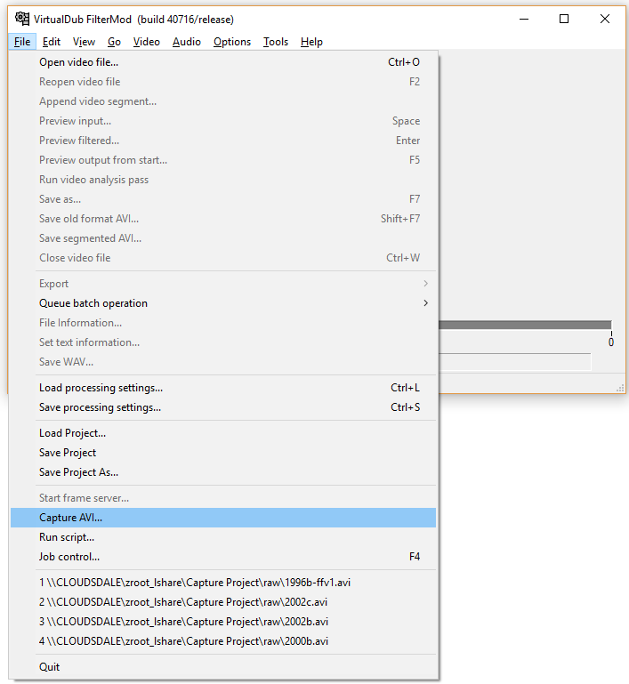
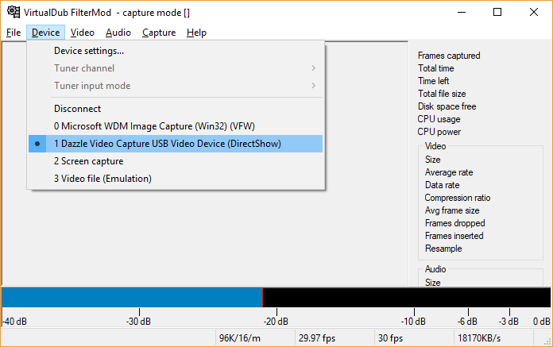
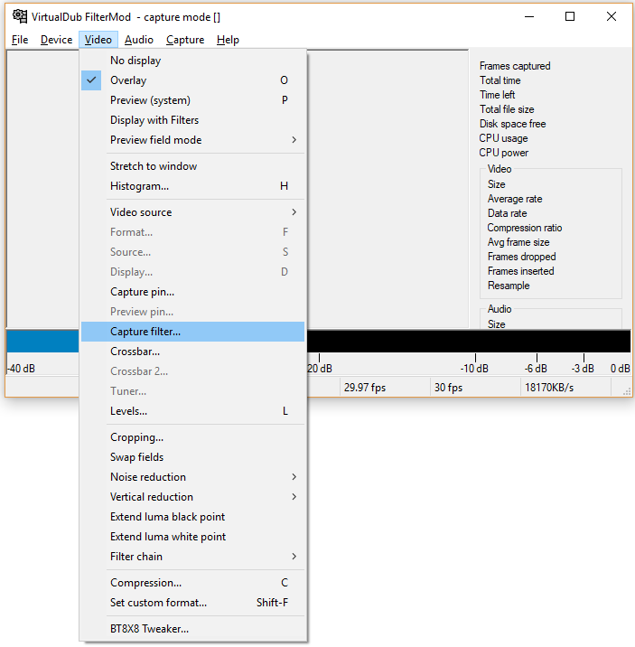
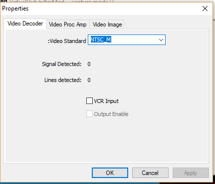
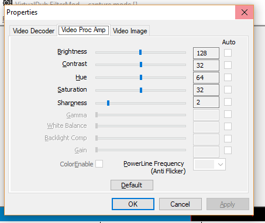
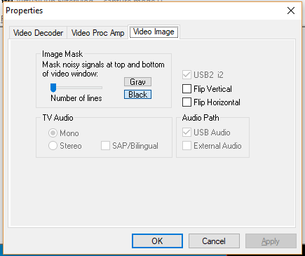

# ffmpeg-helpers

This repository contains documentation of my process for capturing and converting a set of Hi-8 camcorder tapes, with some helper scripts that act as a wrapper around ffmpeg and pyscenedetect.

## Dependencies

* VirtualDub FilterMod (packaged with Lagarith codec)
    * For raw capture
    * Also useful for previewing video and grabbing precise timestamps
* ffmpeg
* pyscenedetect: https://pyscenedetect.readthedocs.io/en/latest/
    * Requires python and other documented dependencies
    * Currently using an older version (v0.4) that uses different command line args.

    

### Optional but also useful

* Mediainfo: https://en.wikipedia.org/wiki/MediaInfo
    * see encoding, framerate, other metadata on a video
* VLC: https://www.videolan.org/vlc/
    * good for previewing video using variable rate playback, testing A/V sync corrections
---
## Lossless Capture using VirtualDub
Enter capture mode:



Select the capture device:



Configure video capture filter:






TODO

### Fixing audio sync problems
TODO

---
## Processing and Compression using ffmpeg
The [export-video.ps1](export-video.ps1) script uses FFMPEG to deinterlace, denoise, remove head-switching noise (in my video sources, 4px from the bottom and left of the frame), encode as H264 video/AAC audio in an MP4 container.

```PowerShell
.\export-video.ps1 -source lossless-source-video.avi -output output-file.mp4 -vfilterscript .\deinterlace-hq.filter -vpresetfile .\lm-camcorder-hq.ffpreset
```

**`-source`**  
Path to the lossless source video from [Lossless Capture using VirtualDub](#lossless-capture-using-virtualdub) (my sources are Lagarith/AVI)

**`-output`**  
Path to the output MP4 file (must have `.mp4` extension)

**`-timestamps`** [optional]  
Specify timestamps for a segment of the source video. If `-fastseek` is set, looks like `-timestamps <start-time>,<segment-length>`, otherwise `-timestamps <start-time>,<end-time>`

Example: `-fastseek -timestamps 1:01.123,2` for a segment starting at 1 minute, 1 second, 123ms that lasts 2 seconds.

**`-fastseek`** [optional]  
Do a faster seek when getting the segment, using the keyframe method. May be inaccurate on stream copy. Does the "third command" detailed at https://trac.ffmpeg.org/wiki/Seeking#Notes instead of the second command.

**`-vfilterscript`** [optional]  
Path to a file that contains video filters (the `*.filter` files in this repository). This becomes the argument to the ffmpeg `-filter_script:v` argument. The contents of the file should be able to work if passed to the `-vf` ffmpeg argument.  
Defaults to [deinterlace-hq.filter](deinterlace-hq.filter). If `deinterlace-hq.filter` is not available, calls ffmpeg with
```
-vf 'yadif=mode=send_field:parity=tff:deint=all, hqdn3d=8, crop=632:472:8:0, scale=640:480'
```

See [Filter Reference](#filter-reference)

**`-vpresetfile`** [optional]  
ffmpeg file containing video encoder (not filter) related arguments.

See [ffpreset Reference](#ffpreset-reference)

### Filter Reference
**[deinterlace-hq.filter](deinterlace-hq.filter)** [default]  
* Deinterlace using [yadif](https://ffmpeg.org/ffmpeg-filters.html#yadif-1). Output one frame for each field, deinterlace all frames, assume top field is first
* Denoise using [hqdn3d](https://ffmpeg.org/ffmpeg-filters.html#hqdn3d-1). `luma_spatial` is set to 8, which is relatively high. (Other parameters calculated from `luma_spatial`)
* Crop 8px from left and bottom to remove head switching noise and dark overscan area
* Scale back up to 640x420

The output ends up being ~60fps after deinterlacing because of one frame for each field.

**[deinterlace-small.filter](deinterlace-small.filter)**  
Same as [deinterlace-hq.filter](deinterlace-hq.filter) but 30fps and scaled to 480x360.

**[deinterlace-hq-border-pad.filter](deinterlace-hq-border-pad.filter)**  
Same as [deinterlace-hq.filter](deinterlace-hq.filter) but with 4px of padding added to all 4 sides to compensate for the overscan cropping.

### ffpreset Reference
**[lm-camcorder-hq.ffpreset](lm-camcorder-hq.ffpreset)** [default]  
 General purpose high quality but slow H264 settings.

**[lm-camcorder-small.ffpreset](lm-camcorder-small.ffpreset)**  
To use for making clips to share when file size is important. General purpose medium quality H264 settings.


---
## Editing and Splitting using pyscenedetect and ffmpeg
### Scene Detection
Scene detection MUST be done on content that has been deinterlaced (H264 MP4 output from [Processing and compression using ffmpeg](#processing-and-compression-using-ffmpeg) )  
The [scenedetect-multi-threshold.py](scenedetect-multi-threshold.py) script uses the pyscenedetect library to find scenes at two thresholds (55 and 40) in content-aware detection mode. The high threshold scenes are likely to be useful for splitting out major sections of the video and the lower threshold is likely to be useful for chapter markers.

Example usage:
```PowerShell
python .\scenedetect-multi-threshold.py .\path\to\a-deinterlaced-video.mp4
```
The script creates a folder in the current working directory. In this subfolder if puts the following:
* CSV files (`<videoname>-scenes-<threshold>-threshold.csv`) containing the detected scene data at both thresholds
* If ffmpeg is available, low-quality compressed videos of each scene detected (to be used to preview scenes)
* `<videoname>.stats.csv` - contains the stats for each frame of the video. This is reused in the second pass for the second threshold and on subsequent runs if found.
From the timestamps in the CSV files, you can then construct a `.csv` file described below in [Editing](#editing).

#### Dependencies
* Python (script developed against 3.7)
* PySceneDetect v0.5
    * OpenCV / cv2 python module: `python -m pip install opencv-python`
    * numpy: `python -m pip install numpy`
    * tqdm (optional): `python -m pip install tqdm`
    * ffmpeg in path (optional, if split video previews are desired)

Alternatively, the standalone PySceneDetect can be used to do each threshold separately.
<!-- TODO: Add example --->

### Editing
Use the [edit-video.ps1](edit-video.ps1) script to remove segments from a video without re-encoding. This should be done on the H264 MP4 output from [Processing and compression using ffmpeg](#processing-and-compression-using-ffmpeg).
```PowerShell
edit-video.ps1 -source path\to\source\video.mp4 -segmentstoremove path\to\file\with\segments-to-cut.csv
```
The `.csv` file contains pairs of time intervals to be removed, designated by the required columns `start_timecode` and `end_timecode`. Any other columns are safely ignored.
Example:
```csv
start_timecode,end_timecode,notes
01:00,02:00,a note
15:11.1,18:45.8,
```
In this case, video from 1 minute in to 2 minutes in, and from 15:11.1 to 18:45.8 will be removed from the output video.

<!-- TODO: investigate why the output here is variable frame rate and deinterlaced video is fixed frame rate? --->

---
## Gifs
TODO